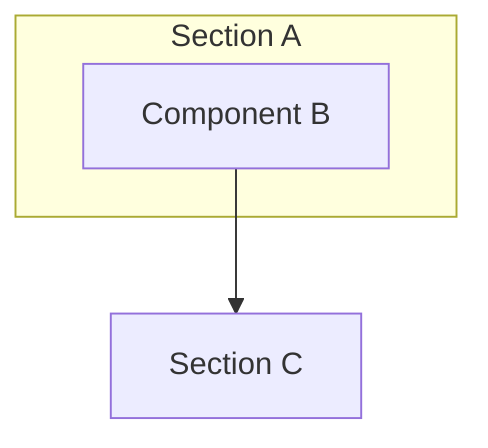

# {project-name}

{One paragraph describing the project purpose and main features.}

**Stack:** {Tech 1} **{Version}**, {Tech 2} **{Version}**, {Architecture/Pattern}.

---

## Prerequisites

- **{Tool} {Version}**
- **Environment variables** — see [Configuration](#configuration).

---

## Quick Start

1. Copy `.env.example` to `.env` and set the required variables.
2. Install dependencies: `{install-command}`
3. Run the development server: `{run-command}`
4. Access the app at `http://localhost:{port}`

---

## Commands

| Action | Command |
|--------|---------|
| Install dependencies | `{install-command}` |
| Run dev server | `{run-command}` |
| Build for production | `{build-command}` |
| Unit tests | `{test-command}` |

---

## {Pages/Endpoints}

| {Col 1} | {Col 2} | {Col 3} | {Col 4} |
|---------|---------|---------|---------|
| {Row 1} | {Row 1} | {Row 1} | {Row 1} |

---

## Architecture



> Full system architecture (C4 Level 1, 2 & 3): [kra-docs-architecture](https://github.com/krealalejo/kra-docs-architecture)

**Structure:** {Brief explanation of the folder organization and logic flow}.

### Source layout

```
{project-name}/
├── .env.example
├── README.md
└── src/
    └── ...
```

---

## Configuration

| Variable | Purpose |
|----------|---------|
| {VAR_NAME} | {Description} |

---

## Deployment

Managed by **Terraform** (`kra-infra`) and deployed via **GitHub Actions**. {Specific deployment details}.

> Run `kra-start` to start the EC2 instance before triggering a deploy pipeline run.
